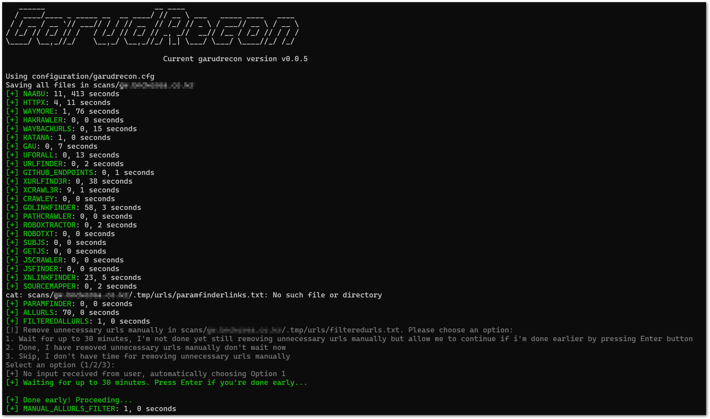
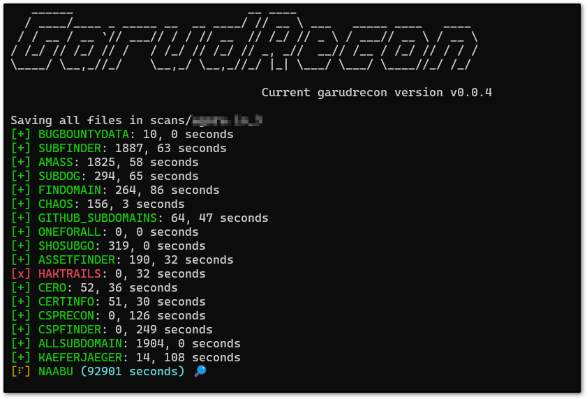
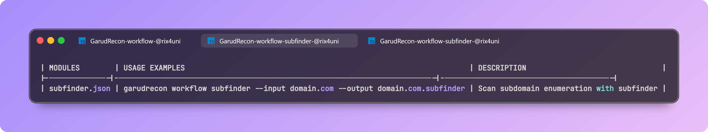

<p align="center">
<a href="#"></a>
<a href="https://ko-fi.com/rix4uni"></a>
<a href="https://x.com/rix4uni"></a>
<a href="https://github.com/rix4uni/GarudRecon/issues"></a>
<a href="https://github.com/rix4uni/GarudRecon/blob/master/LICENSE"></a>
<a href="#"></a>
<a href="https://github.com/rix4uni?tab=followers"></a>
</p>

## GarudRecon

GarudRecon is a comprehensive bash-based reconnaissance automation framework that streamlines the asset discovery and vulnerability assessment process for security professionals and bug bounty hunters. This tool orchestrates over 80+ open-source security tools to provide thorough reconnaissance capabilities across multiple attack vectors.

### Core Capabilities
GarudRecon excels in automated discovery and vulnerability detection across several key areas:

**Asset Discovery & Enumeration**
- Subdomain enumeration using 20+ tools including subfinder, amass, and chaos
- Certificate transparency monitoring through multiple CT log sources  
- DNS enumeration with advanced bruteforcing and permutation techniques
- Port scanning with naabu, masscan, and nmap integration
- Virtual host discovery and web technology fingerprinting

**Vulnerability Detection**
- Cross-Site Scripting (XSS) detection with multiple payload sets
- SQL injection testing through automated parameter fuzzing
- Local File Inclusion (LFI) and Remote Code Execution (RCE) checks
- Subdomain takeover vulnerability scanning
- Open redirect detection and validation
- Exposed .git directories and sensitive file discovery

### Flexible Reconnaissance Modes
The framework provides three distinct operational modes tailored to different engagement scopes:
- **SmallScope Mode** - Designed for focused subdomain reconnaissance (e.g., support.domain.com) with deep vulnerability analysis on a limited attack surface.
- **MediumScope Mode** - Comprehensive wildcard domain scanning (e.g., *.domain.com) with balanced coverage and performance optimization.
- **LargeScope Mode** - Organization-wide reconnaissance for maximum asset discovery and extensive vulnerability coverage.
- **CidrScope Mode** - Not completed yet
- **Workflow Mode** - Chain multiple tools into a reusable pipeline so you can run complex scans with a single command.
- **Fleet Mode** - Distribute work across many VPS instances — split input automatically and run modules in parallel on 100+ hosts.
- **CronJobs Mode** - Schedule and monitor recurring recon tasks (subdomains, open ports, JS leaks, templates, alerts).

### Advanced Features
**Automated Monitoring**
- Continuous subdomain monitoring with change detection
- Port state change notifications  
- JavaScript file monitoring for new endpoints
- Automated scheduled reconnaissance via cron integration

**Intelligent Resource Management**
- RAM-optimized configurations for different system specifications
- VPS deployment optimization settings
- Parallel processing with configurable thread limits
- Custom wordlist generation based on target characteristics

## History
I originally created **GarudRecon** in 2022, but I later removed it after some API keys were accidentally leaked. Despite this, someone forked the project and preserved it [here](https://github.com/polling-repo-continua/GarudRecon).

Afterwards, I experimented with rewriting GarudRecon in **Python** and **Go**, but I found the heavy string concatenation in those languages unappealing. In the end, I decided to return to **Bash**, which felt simpler and more natural for me.

## Referral Links

<p align="center">
<a href="https://m.do.co/c/43c704381b79" target="_blank">

</a>
</p>

<p align="center">
<a href="https://login.linode.com/signup" target="_blank">

</a>
</p>

<p align="center">
<a href="https://cloud.ibm.com/docs/overview?topic=overview-tutorial-try-for-free" target="_blank">

</a>
</p>

<p align="center">
<a href="https://aws.com" target="_blank">

</a>
</p>

<p align="center">
<a href="https://azure.com" target="_blank">

</a>
</p>

<p align="center">
<a href="https://cloud.intechdc.com/?affid=443&oid=99" target="_blank">

</a>
</p>

## Installation

> **Note:** Switch to the **root** user first (instead of using `sudo su`) before running the installation command.  
> This helps avoid permission and environment-related issues.  
>  
> If any tool fails to install during the script execution, install it manually.  
>  
> Make sure your shell is set to **bash**.

### Docker
```

```

### Easy Install `Recommended`
```
bash <(curl -s https://raw.githubusercontent.com/rix4uni/GarudRecon/main/configure) --update
```

<details>
  <summary><b>✅ Configure Examples:</b></summary>

```yaml
👉 Installtion modes:
echo "Choose installation scope:"
echo "1) SMALLSCOPE"
echo "2) MEDIUMSCOPE"
echo "3) LARGESCOPE"
echo "4) CIDRSCOPE"
echo "5) WORKFLOW"
echo "6) FLEET"
echo "7) CRONJOBS"
echo "8) ALL (default)"

👉 Non-interactive without update:
bash <(curl -s https://raw.githubusercontent.com/rix4uni/GarudRecon/main/configure) 5
# Executes: garudrecon install -f CRONJOBS

👉 Non-interactive with update:
bash <(curl -s https://raw.githubusercontent.com/rix4uni/GarudRecon/main/configure) 5 --update
# Executes: garudrecon install -f CRONJOBS --update

👉 Interactive mode (no args):
bash <(curl -s https://raw.githubusercontent.com/rix4uni/GarudRecon/main/configure)
# Interactive prompts as before
```
</details>

<details>
  <summary><b>✅ Discord Webhook Setup</b></summary>

```yaml
👉 Add all discord webhook url in /root/.config/notify/provider-config.yaml:
discord:
  - id: "manualcheck"
    discord_channel: "manualcheck"
    discord_username: "manualcheck"
    discord_format: "{{data}}"
    discord_webhook_url: ""

  - id: "subdomain"
    discord_channel: "subdomain"
    discord_username: "subdomain"
    discord_format: "{{data}}"
    discord_webhook_url: ""

  - id: "ports"
    discord_channel: "ports"
    discord_username: "ports"
    discord_format: "{{data}}"
    discord_webhook_url: ""

  - id: "alivesubdomain"
    discord_channel: "alivesubdomain"
    discord_username: "alivesubdomain"
    discord_format: "{{data}}"
    discord_webhook_url: ""

  - id: "javascript"
    discord_channel: "javascript"
    discord_username: "javascript"
    discord_format: "{{data}}"
    discord_webhook_url: ""

  - id: "javascriptleaks"
    discord_channel: "javascriptleaks"
    discord_username: "javascriptleaks"
    discord_format: "{{data}}"
    discord_webhook_url: ""

  - id: "xss"
    discord_channel: "xss"
    discord_username: "xss"
    discord_format: "{{data}}"
    discord_webhook_url: ""

  - id: "allvuln"
    discord_channel: "allvuln"
    discord_username: "allvuln"
    discord_format: "{{data}}"
    discord_webhook_url: ""

  - id: "scanfinished"
    discord_channel: "scanfinished"
    discord_username: "scanfinished"
    discord_format: "{{data}}"
    discord_webhook_url: ""
```
</details>

### Download prebuilt binaries
```
wget -q https://github.com/rix4uni/GarudRecon/archive/refs/tags/v0.1.2.zip
unzip v0.1.2.zip
cd GarudRecon
bash configure
```

### Using Git Clone
```
git clone --depth 1 https://github.com/rix4uni/GarudRecon.git
cd GarudRecon
bash configure
```

## Usage

<details>
  <summary><b>GarudRecon Help</b></summary>

```
GarudRecon is a comprehensive bash-based reconnaissance automation framework that streamlines the asset discovery and vulnerability assessment process for security professionals and bug bounty hunters. This tool orchestrates over 80+ open-source security tools to provide thorough reconnaissance capabilities across multiple attack vectors.

Usage:
  garudrecon [command]

Available Commands:
  install                 Install the tool and all required dependencies.
  smallscope              Quick recon for a single host or subdomain (e.g. support.domain.com).
  mediumscope             Moderate recon for a wildcard domain (e.g. *.domain.com) with optional vuln checks.
  largescope              Full-scale recon for an organization.
  cidrscope               Run a full scan against one or more CIDR ranges.
  workflow                Chain multiple tools into a reusable pipeline so you can run complex scans with a single command.
  fleet                   Distribute work across many VPS instances — split input automatically and run modules in parallel on 100+ hosts.
  cronjobs                Schedule and monitor recurring recon tasks (subdomains, open ports, JS leaks, templates, alerts).

Flags:
  -h, --help     help for garudrecon
  -v, --version  Display the current version

Use "garudrecon [command] --help" for more information about a command.
```
</details>


<details>
  <summary><b>GarudRecon Install</b></summary>

```
Install the tool and all required dependencies.
Runs setup tasks and installs any system or language packages your tool needs so you can start scanning immediately.

Usage:
  garudrecon install [flags]

Flags:
  -f, --function        Function to run (e.g. MEDIUMSCOPE)
  -c, --config          Custom configuration file path
  -up, --update         Update all tools to latest version
  -v, --verbose         enable verbose mode
  -h, --help            help for install

Example:
  garudrecon install -f SMALLSCOPE
  garudrecon install -f MEDIUMSCOPE
  garudrecon install -f LARGESCOPE
  garudrecon install -f CIDRSCOPE
  garudrecon install -f WORKFLOW
  garudrecon install -f FLEET
  garudrecon install -f CRONJOBS
  garudrecon install -f ALL
  garudrecon install -f ALL --update
```


#### Output

</details>


<details>
  <summary><b>SmallScope Mode</b></summary>

```
Quick recon for a single host or subdomain (e.g. support.domain.com).
Lightweight, fast checks — ideal for a single target when you want quick visibility without a full-scale scan.

Usage:
  garudrecon smallscope [flags]

Flags:
  -d, --domain                          Scan a domain (e.g. support.domain.com)
  -ef, --exclude-functions              Exclude a function from running (e.g. WAYMORE)
  -rx, --recon-xss                      Run full recon with XSS checks
  -rs, --recon-sqli                     Run full recon with SQLi checks
  -rl, --recon-lfi                      Run full recon with LFI checks
  -rst, --recon-subtakeover             Run full recon with Subdomain Takeover checks
  -rr, --recon-rce                      Run full recon with RCE checks
  -ri, --recon-iis                      Run full recon with IIS checks
  -c, --config                          Custom configuration file path
  -r, --resume <scan_folder>            Resume stopped/uncompleted scan from /root/.garudrecon/scans/<scan_folder> (e.g., --resume support.domain.com or --resume support.domain.com_1). Skips functions already completed in resume.cfg.
  -h, --help                            help for smallscope

Example:
# Full recon
  garudrecon smallscope -d support.domain.com

# Recon with XSS only
  garudrecon smallscope -d support.domain.com -rx

# Recon with SQLi only
  garudrecon smallscope -d support.domain.com -rs

# Exclude functions manually
  garudrecon smallscope -d support.domain.com -ef "GOSPIDER,WAYMORE"

# Combined
  garudrecon smallscope -d support.domain.com -rx -ef "WAYMORE"

# Skips functions already completed in resume.cfg.
  garudrecon smallscope -d support.domain.com -rx --resume support.domain.com_1
```

#### Output

</details>


<details>
  <summary><b>MediumScope Mode</b></summary>

```
Moderate recon for a wildcard domain (e.g. *.domain.com) with optional vuln checks.
Balanced scan depth: discovers subdomains, does basic service/port checks and optional lightweight vulnerability checks.

Usage:
  garudrecon mediumscope [flags]

Flags:
  -d, --domain                          Scan a domain (e.g. domain.com)
  -ef, --exclude-functions              Exclude a function from running (e.g. AMASS)
  -s, --recon-subdomain                 Run Subdomain Enumeration only
  -a, --active                          Run Active Subdomain Enumeration also (e.g. puredns, altdns)
  -su, --recon-subdomainurls            Run Subdomain Enumeration + Url Crawling only
  -rx, --recon-xss                      Run full recon with XSS checks
  -rs, --recon-sqli                     Run full recon with SQLi checks
  -rl, --recon-lfi                      Run full recon with LFI checks
  -rst, --recon-subtakeover             Run full recon with Subdomain Takeover checks
  -rr, --recon-rce                      Run full recon with RCE checks
  -ri, --recon-iis                      Run full recon with IIS checks
  -oos, --outofscope                    Exclude outofscope subdomains from a list (e.g. domain.com.oos)
  -c, --config                          Custom configuration file path
  -r, --resume <scan_folder>            Resume stopped/uncompleted scan from /root/.garudrecon/scans/<scan_folder> (e.g., --resume domain.com or --resume domain.com_1). Skips functions already completed in resume.cfg.
  -h, --help                            help for mediumscope

Example:
# Full recon with all vulnerability scan
  garudrecon mediumscope -d domain.com

# Recon Subdomain Enumeration only
  garudrecon mediumscope -d domain.com -s

# Run Active Subdomain Enumeration also (e.g. puredns, altdns)
  garudrecon mediumscope -d domain.com -s -a

# Recon Subdomain Enumeration + Url Crawling only
  garudrecon mediumscope -d domain.com -su

# Recon with XSS only
  garudrecon mediumscope -d domain.com -rx

# Recon with SQLi only
  garudrecon mediumscope -d domain.com -rs

# Exclude functions manually
  garudrecon mediumscope -d domain.com -ef "SUBFINDER,AMASS"

# Combined
  garudrecon mediumscope -d domain.com -rx -ef "AMASS"

# Skips functions already completed in resume.cfg.
  garudrecon mediumscope -d domain.com -rx --resume domain.com_1
```

#### Output

</details>


<details>
  <summary><b>LargeScope Mode</b></summary>

```
Full-scale recon for an organization.
Deep discovery and enumeration (subdomains, ports, asset correlation, extensive vuln checks) for comprehensive coverage.

Usage:
  garudrecon largescope [flags]

Flags:
  -d, --domain                          Scan a domain (e.g. domain)
  -ef, --exclude-functions              Exclude a function from running (e.g. AMASS)
  -s, --recon-subdomain                 Run Subdomain Enumeration only
  -a, --active                          Run Active Subdomain Enumeration also (e.g. puredns, altdns)
  -su, --recon-subdomainurls            Run Subdomain Enumeration + Url Crawling only
  -rx, --recon-xss                      Run full recon with XSS checks
  -rs, --recon-sqli                     Run full recon with SQLi checks
  -rl, --recon-lfi                      Run full recon with LFI checks
  -rst, --recon-subtakeover             Run full recon with Subdomain Takeover checks
  -rr, --recon-rce                      Run full recon with RCE checks
  -ri, --recon-iis                      Run full recon with IIS checks
  -oos, --outofscope                    Exclude outofscope subdomains from a list (e.g. domain.oos)
  -c, --config                          Custom configuration file path
  -r, --resume <scan_folder>            Resume stopped/uncompleted scan from /root/.garudrecon/scans/<scan_folder> (e.g., --resume domain or --resume domain_1). Skips functions already completed in resume.cfg.
  -h, --help                            help for largescope

Example:
# Full recon with all vulnerability scan
  garudrecon largescope -d domain

# Recon Subdomain Enumeration only
  garudrecon largescope -d domain -s

# Run Active Subdomain Enumeration also (e.g. puredns, altdns)
  garudrecon largescope -d domain -s -a

# Recon Subdomain Enumeration + Url Crawling only
  garudrecon largescope -d domain -su

# Recon with XSS only
  garudrecon largescope -d domain -rx

# Recon with SQLi only
  garudrecon largescope -d domain -rs

# Exclude functions manually
  garudrecon largescope -d domain -ef "SUBFINDER,AMASS"

# Combined
  garudrecon largescope -d domain -rx -ef "AMASS"

# Skips functions already completed in resume.cfg.
  garudrecon largescope -d domain -rx --resume domain_1
```

#### Output

</details>


<details>
  <summary><b>CidrScope Mode</b></summary>

```
```

#### Output
</details>


<details>
  <summary><b>Workflow Mode</b></summary>

```
Chain multiple tools into a reusable pipeline so you can run complex scans with a single command.
Compose small steps (mapcidr → httpx → nuclei …) into one workflow file and execute it without manually installing or running each tool.

Usage:
  garudrecon workflow [flags]

Flags:
  -i, --input       Pass the input
  -o, --output      Location where you want to save output
  -v, --verbose     enable verbose mode
  -h, --help        help for modules

Example:
  garudrecon workflow amass --input <domain> --output <file> [--verbose]
  garudrecon workflow CVE-2025-0133 -i all.cidr -o CVE-2025-0133.nuclei
  garudrecon workflow ls
  garudrecon workflow ls [module]
  garudrecon workflow cat [module]
  garudrecon workflow add [module]
  garudrecon workflow edit [module]
  garudrecon workflow delete [module]
```

Check invalid
```
for f in modules/*.json; do
  echo -n "Checking $f ... "
  jq empty "$f" && echo "✅ OK" || echo "❌ INVALID"
done
```

#### Output



</details>


<details>
  <summary><b>Fleet Mode</b></summary>

## This is temporary setup for now in next update i'll add progress bar
```
## Add passwords like this to avoid single/double quotes problem, you can use https://codepen.io/rix4uni/pen/PwZzdpV
4fd6dbe0Haafa1d7bf4df9f96597e48p

## Save credentials in master.credentials and worker.credentials, in this format:
## touch master.credentials worker.credentials
## nano master.credentials
## nano worker.credentials
root@IP:PASSWORD
root@IP:PASSWORD

# Run both commands one by one on master vps
bash <(curl -s https://raw.githubusercontent.com/rix4uni/GarudRecon/main/configure) 5
bash <(curl -s https://raw.githubusercontent.com/rix4uni/GarudRecon/main/configure) 6

## Wait for 15-20 minutes then check 1 worker if there is no tmux session that means fleet setup is done all workers, now run this command

# Check is everything working fine
## nano subs.txt
krazeplanet.com
labs.krazeplanet.com

garudrecon fleet -m workerscheck -i subs.txt -o subs.output --verbose
```

```
Distribute work across many VPS instances — split input automatically and run modules in parallel on 100+ hosts.
Use one command to shard data, push jobs to remote nodes, run the chosen module, and collect consolidated results. Perfect for massively-parallel scans.

Usage:
  garudrecon fleet [flags]

Flags:
  -i, --input       Pass the input
  -o, --output      Location where you want to save output
  -m, --module      module name you want to run
  -h, --help        help for modules

Example:
  garudrecon fleet -m <module> -i <wildcards> -o <file>
  garudrecon fleet -m subfinder -i wildcards.txt -o wildcards.subs
```

</details>


<details>
  <summary><b>CronJobs Mode</b></summary>

```
Schedule and monitor recurring recon tasks (subdomains, open ports, JS leaks, templates, alerts).
Run continuous monitoring: periodic scans, delta detection, and notifications when new assets or issues appear.

Usage:
  garudrecon cronjobs [flags]

Flags:
  -d, --domain                  Domain to monitor
  -f, --function                Function to run (e.g. MONITOR_SUBDOMAIN)
  -c, --config                  Custom configuration file path
  -i, --interval                Customize the sleep duration (e.g. 1800)
  -v, --verbose                 enable verbose mode
  -h, --help                    help for cronjobs

Example:
  garudrecon cronjobs -d domain.com -f MONITOR_SUBDOMAIN
  garudrecon cronjobs -d domain.com -f MONITOR_PORTS
  garudrecon cronjobs -d domain.com -f MONITOR_ALIVESUBD
  garudrecon cronjobs -d domain.com -f MONITOR_JS
  garudrecon cronjobs -d domain.com -f MONITOR_JSLEAKS
```

#### Output


</details>

<details>
  <summary><b>✅ Short commands</b></summary>

```yaml
👉 Short commands automatically adds in ~/.bashrc during installation:
gs="garudrecon smallscope"
gm="garudrecon mediumscope"
gl="garudrecon largescope"
gcidr="garudrecon cidrscope"
gw="garudrecon workflow"
gf="garudrecon fleet"
gc="garudrecon cronjobs"
```
</details>

## Demo

## Operating Systems Supported

| OS         | Supported | Easy Install | Tested        |
| ---------- | --------- | ------------ | ------------- |
| Ubuntu     | ✅       | ✅          | Ubuntu 24.04   |
| Kali       | ✅       | ✅          | Kali 2025.2    |
| Debian     | ✅       | ✅          | ❌             |
| Windows    | ✅       | ✅          | WSL Ubuntu     |
| MacOS      | ✅       | ✅          | ❌             |
| Arch Linux | ✅       | ❌          | ❌             |

## Default Excluded Functions, You can change if you want

| NAME                      | 1GB RAM | 2GB RAM | 4GB RAM | 6GB RAM | 8GB RAM | 16GB RAM |
| ------------------------- | ------- | ------- | ------- | ------- | ------- | -------- |
| BBOT                      | ❌      | ❌     | ✅      | ✅     | ✅      | ✅      |
| ONEFORALL                 | ❌      | ❌     | ✅      | ✅     | ✅      | ✅      |
| KAEFERJAEGER              | ❌      | ❌     | ✅      | ✅     | ✅      | ✅      |
| TRICKESTCLOUD             | ❌      | ❌     | ✅      | ✅     | ✅      | ✅      |
| DNSXBRUTE                 | ❌      | ❌     | ✅      | ✅     | ✅      | ✅      |
| SUBWIZ                    | ❌      | ❌     | ✅      | ✅     | ✅      | ✅      |
| RECURSIVESUBENUM          | ❌      | ❌     | ✅      | ✅     | ✅      | ✅      |
| ALTDNS                    | ❌      | ❌     | ✅      | ✅     | ✅      | ✅      |
| PUREDNS                   | ❌      | ❌     | ✅      | ✅     | ✅      | ✅      |
| ALTERX                    | ❌      | ❌     | ✅      | ✅     | ✅      | ✅      |
| GOTATOR                   | ❌      | ❌     | ✅      | ✅     | ✅      | ✅      |
| DNSGEN                    | ❌      | ❌     | ✅      | ✅     | ✅      | ✅      |
| GOALTDNS                  | ❌      | ❌     | ✅      | ✅     | ✅      | ✅      |
| RIPGEN                    | ❌      | ❌     | ✅      | ✅     | ✅      | ✅      |
| DMUT                      | ❌      | ❌     | ✅      | ✅     | ✅      | ✅      |
| DNSCEWL                   | ❌      | ❌     | ✅      | ✅     | ✅      | ✅      |
| ALLSUBDOMAINPERMUTATIONS  | ❌      | ❌     | ✅      | ✅     | ✅      | ✅      |
| MANUAL_SUBDOMAIN_RESOLVING| ❌      | ❌     | ✅      | ✅     | ✅      | ✅      |
| PUREDNS                   | ❌      | ❌     | ✅      | ✅     | ✅      | ✅      |
| SHUFFLEDNS                | ❌      | ❌     | ✅      | ✅     | ✅      | ✅      |
| MASSDNS                   | ❌      | ❌     | ✅      | ✅     | ✅      | ✅      |
| FFUFBRUTE                 | ❌      | ❌     | ✅      | ✅     | ✅      | ✅      |
| FFUFVHOST                 | ❌      | ❌     | ✅      | ✅     | ✅      | ✅      |
| GOWITNESS                 | ❌      | ❌     | ✅      | ✅     | ✅      | ✅      |
| AQUATONE                  | ❌      | ❌     | ✅      | ✅     | ✅      | ✅      |
| EYEWITNESS                | ❌      | ❌     | ✅      | ✅     | ✅      | ✅      |
| HTTPX_SS                  | ❌      | ❌     | ✅      | ✅     | ✅      | ✅      |
| FFUFDIRENUM               | ❌      | ❌     | ✅      | ✅     | ✅      | ✅      |
| DIRSEARCH                 | ❌      | ❌     | ✅      | ✅     | ✅      | ✅      |
| FEROXBUSTER               | ❌      | ❌     | ✅      | ✅     | ✅      | ✅      |
| WFUZZ                     | ❌      | ❌     | ✅      | ✅     | ✅      | ✅      |
| CRAWLEY                   | ❌      | ❌     | ✅      | ✅     | ✅      | ✅      |
| GALER                     | ❌      | ❌     | ❌      | ❌     | ❌      | ❌      |
| MSARJUN                   | ❌      | ✅     | ✅      | ✅     | ✅      | ✅      |
| X8                        | ❌      | ✅     | ✅      | ✅     | ✅      | ✅      |
| CEWL                      | ❌      | ❌     | ✅      | ✅     | ✅      | ✅      |
| UNFURL                    | ❌      | ❌     | ✅      | ✅     | ✅      | ✅      |
| CUSTOM_PARAM              | ❌      | ❌     | ✅      | ✅     | ✅      | ✅      |
| COOK                      | ❌      | ❌     | ✅      | ✅     | ✅      | ✅      |
| PYDICTOR                  | ❌      | ❌     | ✅      | ✅     | ✅      | ✅      |
| FFUF_CUSTOM_PARAM         | ❌      | ❌     | ✅      | ✅     | ✅      | ✅      |
| VULNTECHX                 | ❌      | ❌     | ✅      | ✅     | ✅      | ✅      |
| PYXSS                     | ❌      | ❌     | ✅      | ✅     | ✅      | ✅      |


## Tools

### Subdomain Enumeration
- BugBountyData
- subfinder
- amass
- subdog
- xsubfind3r
- findomain
- chaos
- github-subdomains
- bbot
- oneforall
- shosubgo
- assetfinder
- haktrails
- haktrailsfree
- org2asn
- ipfinder
- ipranges
- arinrange
- spk
- analyticsrelationships
- udon
- builtwithsubs
- whoxysubs

### Certificate Transperency
- kaeferjaeger
- trickestcloud
- cero
- certinfo
- csprecon
- cspfinder
- jsubfinder
- dnsxbrute
- subwiz

### Subdomain Permutations
- altdns
- puredns
- alterx
- gotator
- dnsgen
- goaltdns
- ripgen
- dmut

### Subdomain Resolving
- puredns
- shuffledns
- massdns

### Subdomain DNS Enumeration
- dnsx

### Port Scanning
- naabu
- masscan
- rustscan
- nmap

### Subdomain Probing
- httpx

### Subdomain Bruteforcing
- subdomainfuzz

### VHOST Dicovery
- ffuf

### Favicon Lookup
- favinfo
- favirecon

### Screenshotting
- gowitness
- aquatone
- eyewitness
- httpx

### Directory Enumeration
- ffuf
- dirsearch
- feroxbuster
- wfuzz

### Email Enumeration
- emailfinder

### Url Crawling
- waymore
- hakrawler
- waybackurls
- katana
- gau
- gospider
- uforall
- cariddi
- urlfinder
- github-endpoints
- xurlfind3r
- xcrawl3r
- crawley
- GoLinkFinder
- galer
- gourlex
- pathfinder
- pathcrawler
- roboxtractor
- robotxt

### Google Dorking
- gorker

### JS Crawling
- subjs
- getJS
- jscrawler
- jsfinder
- javascript-deobfuscator
- linkfinder
- xnLinkFinder
- getjswords
- sourcemapper
- linx
- jsluice

### Hidden Parameter
- paramfinder
- msarjun
- x8

### Program Based Wordlist Generator
- cewl
- unfurl
- cook
- pydictor

### Subdomain Takeover
- subzy
- nuclei

### MX Takeover
- mx-takeover

### DNS takeover
- dnstake

### Zone Transfer
- dig

### Vulnerability Scanning
- ftpx
- sshx
- s3scanner
- vulntechx
- pvreplace
- xsschecker
- pyxss
- gosqli
- commix
- goop
- pdftotext
- trufflehog
- secretfinder
- mantra
- shortscan
- linkinspector
- brutespray

## Thanks 🙏
_Thanks for creating awesome tools_

<details>
  <summary><b><a href="https://github.com/projectdiscovery">projectdiscovery</a></b></summary>

- [httpx](https://github.com/projectdiscovery/httpx)
- [nuclei](https://github.com/projectdiscovery/nuclei)
- [subfinder](https://github.com/projectdiscovery/subfinder)
- [cvemap](https://github.com/projectdiscovery/cvemap)
- [katana](https://github.com/projectdiscovery/katana)
- [naabu](https://github.com/projectdiscovery/naabu)
- [mapcidr](https://github.com/projectdiscovery/mapcidr)
- [shuffledns](https://github.com/projectdiscovery/shuffledns)
- [uncover](https://github.com/projectdiscovery/uncover)
- [asnmap](https://github.com/projectdiscovery/asnmap)
- [cdncheck](https://github.com/projectdiscovery/cdncheck)
- [dnsx](https://github.com/projectdiscovery/dnsx)
- [chaos](https://github.com/projectdiscovery/chaos)
- [tldfinder](https://github.com/projectdiscovery/tldfinder)
- [alterx](https://github.com/projectdiscovery/alterx)
- [tlsx](https://github.com/projectdiscovery/tlsx)
- [interactsh-client](https://github.com/projectdiscovery/interactsh-client)

</details>


<details>
  <summary><b><a href="https://github.com/tomnomnom">tomnomnom</a></b></summary>

- [httprobe](https://github.com/tomnomnom/httprobe)
- [assetfinder](https://github.com/tomnomnom/assetfinder)
- [waybackurls](https://github.com/tomnomnom/waybackurls)
- [fff](https://github.com/tomnomnom/fff)
- [meg](https://github.com/tomnomnom/meg)
- [meg](https://github.com/tomnomnom/meg)
- [anew](https://github.com/tomnomnom/anew)
- [gron](https://github.com/tomnomnom/gron)
- [unfurl](https://github.com/tomnomnom/unfurl)
- [gf](https://github.com/tomnomnom/gf)
- [qsreplace](https://github.com/tomnomnom/qsreplace)

</details>


<details>
  <summary><b><a href="https://github.com/rix4uni">rix4uni</a></b></summary>

- [techx](https://github.com/rix4uni/techx)
- [unew](https://github.com/rix4uni/unew)
- [ip2org](https://github.com/rix4uni/ip2org)
- [certinfo](https://github.com/rix4uni/certinfo)
- [xsschecker](https://github.com/rix4uni/xsschecker)
- [portmap](https://github.com/rix4uni/portmap)
- [paramfinder](https://github.com/rix4uni/paramfinder)
- [Gxss](https://github.com/rix4uni/Gxss)
- [msarjun](https://github.com/rix4uni/msarjun)

</details>


<details>
  <summary><b><a href="https://github.com/hakluke">hakluke</a></b></summary>

- [hakrawler](https://github.com/hakluke/hakrawler)
- [hakrevdns](https://github.com/hakluke/hakrevdns)
- [haklistgen](https://github.com/hakluke/haklistgen)
- [hakoriginfinder](https://github.com/hakluke/hakoriginfinder)
- [hakcheckurl](https://github.com/hakluke/hakcheckurl)
- [haktrails](https://github.com/hakluke/haktrails)
- [hakip2host](https://github.com/hakluke/hakip2host)

</details>


<details>
  <summary><b><a href="https://github.com/jaeles-project">jaeles-project</a></b></summary>

- [gospider](https://github.com/jaeles-project/gospider)
- [jaeles](https://github.com/jaeles-project/jaeles)

</details>


<details>
  <summary><b><a href="https://github.com/lc">lc</a></b></summary>

- [gau](https://github.com/lc/gau)
- [subjs](https://github.com/lc/subjs)

</details>

## Thanks for #bugbountytips 🙏
- https://xmind.app/m/hKKexj
- https://x.com/ADITYASHENDE17/status/1527294113552297986
- https://youtu.be/rbyifgOQIrc?t=17m38s

## Changelog

## Mindmap/Workflow
_See Workflow in different format [Workflow](Workflow)_

<p align="center"> 
<a href="Workflow/Scope-Based-Recon.png" target="_blank"> 

</a>  
</p>
